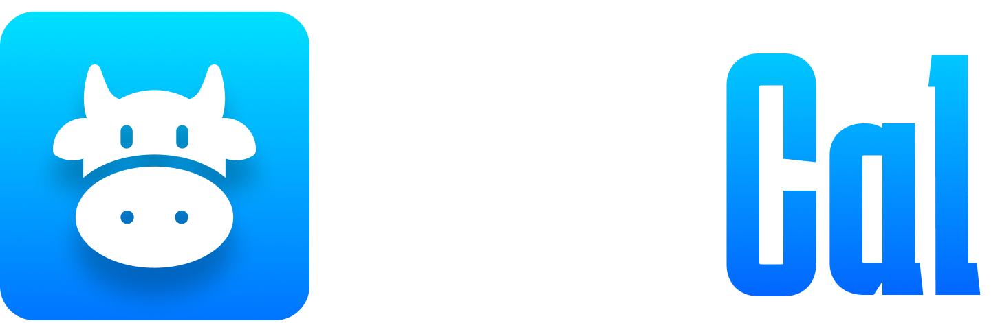
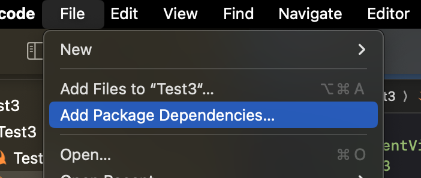
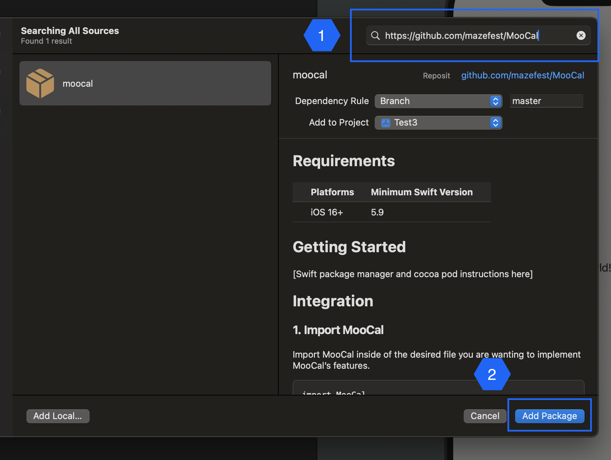
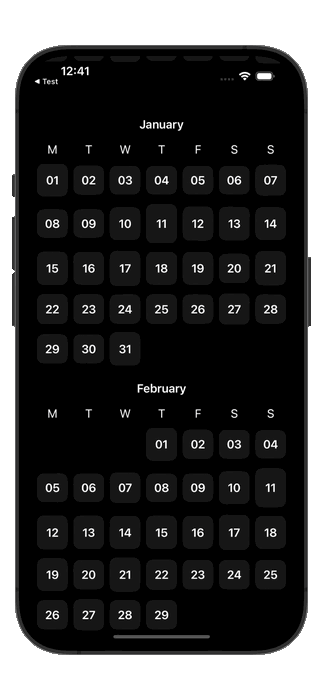

<p align="center">

</p>
Moocal is a lightweight SwiftUI calendar library designed to simplify the creation and customization of calendars in your SwiftUI applications. Whether you're building a productivity app, an event planner, or any application that requires calendar functionality, Moocal is your go-to solution. If you want to see an example app using MooCal, see our test app.

[Access Test App](https://github.com/mazefest/MooCal/wiki/Accessing-the-Test-App)

# Requirements

| Platforms    | Minimum Swift Version |
|--------------|-----------------------|
| iOS 16+      | 5.9                   |

# Getting Started

### Swift Package Manager
1. in XCode go to `File` -> `Add Package Dependencies...`



2. In the searchbar paste the github url `https://github.com/mazefest/MooCal` and select `Add Package`.
   


Now you can import MooCal and use the library where ever you like.

# Integration

### 1. Import MooCal

Import MooCal inside of the desired file you are wanting to implement MooCal's features.

```swift
import MooCal
````

### 2. Setup View

In the view you are wanting to add the scrollable calendar, create a `ScrollableCalendarViewViewModel` and store it as a variable.

```swift
struct ContentView: View {
    var viewModel: ScrollableCalendarViewViewModel
    
    init() {
        self.viewModel = ScrollableCalendarViewViewModel()
    }
    
    var body: some View {

    }
}
```

Next you will need to initialize the `ScrollableCalendarView` inside of the var body, it takes in two parameters.


```swift
 ScrollableCalendarView(viewModel: ScrollableCalendarViewViewModel, calendarDayView: CalendarDayView)
```

* `viewModel` - [ScrollableCalendarViewViewModel] The viewModel we just made above
* `calendaryDayView` - [CalendarDayView] This determines the view of each individual day inside the calendar

## 3. Select Calendar Style
In this documentation we are going ot continue on with the `Custom` calendar day view implementation, but if you are interested in the other offering, checkout the our premade calendar day view implementations below by linking to our wiki.

1. Custom
2. [Classic](https://github.com/mazefest/MooCal/wiki/Default-Calendar-Styles#classic-implementation)
3. [Numbered](https://github.com/mazefest/MooCal/wiki/Default-Calendar-Styles#numbered-implementation)

## 4. Implementing Calendar Style (Custom Implementation)

When choosing to use the custom implementation your code will look like the following. The Custom implementation provides a completion handler where you will return the `CalendarDay` of the view you need to draw, which gives you all you need to create your custom calendar day view, and then you will have to return the `View`.

```swift
var body: some View {
    ScrollableCalendarView(
        viewModel: viewModel,
        calendarDayView: .custom( // <--- HERE
            { calendarDay in
                // Your custom view implementation here
            }
        )
    )
}
```

Now you will need to provide your custom view to the completion handle. The `CalendarDay` is going to be vital for doing so. I recommend creating a function that takes in a `CalendarDay` parameter and returns a view. Forexample:

```swift
private func customCalendarDayView(_ calendarDay: CalendarDay) -> some View {
    ZStack {
        RoundedRectangle(cornerRadius: 10.0)
            .foregroundStyle(Color.gray.opacity(0.13))
        Text(calendarDay.descriptor) // The day number. ex: 11
            .bold()
    }
    .aspectRatio(contentMode: .fit)
}
```

This function will return a rounded rectangle with the numbered day of month centered on top of it.

Next you will need to put this function inside the compltion handler.

```swift
var body: some View {
    ScrollableCalendarView(
        viewModel: viewModel,
        calendarDayView: .custom(
            { calendarDay in
                customCalendarDayView(calendarDay) // <-- HERE
            }
        )
    )
}

```

This will be the result of the above code.



# Further Implementation
If you want to add more functionality to your calendar, make sure to take a look at our Wiki, there is a lot more functionality you can add very easily.

* [Responding To Day Selection](https://github.com/mazefest/MooCal/wiki/Further-Implementation#responding-to-day-selection)
* [Auto Scrolling To Current Month](https://github.com/mazefest/MooCal/wiki/Further-Implementation#auto-scrolling-to-current-month)

# Test App
For full examples of implementing a full calendar app, see the test app below.

[Access Test App](https://github.com/mazefest/MooCal/wiki/Accessing-the-Test-App)
